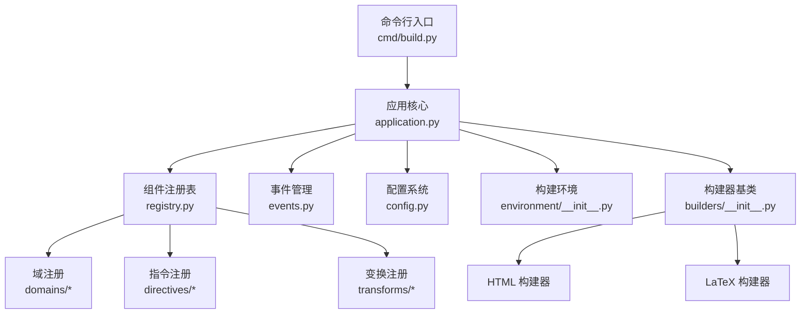
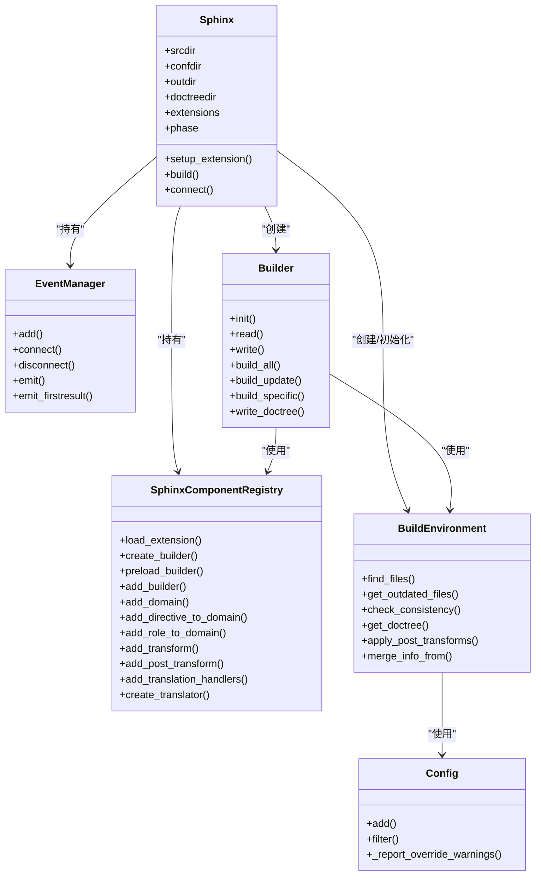
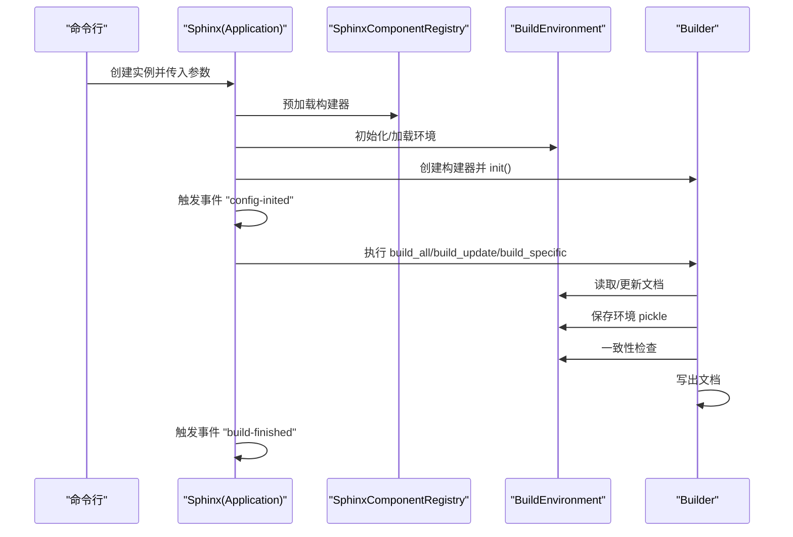
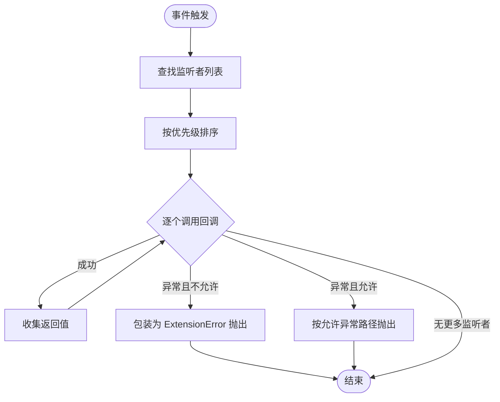
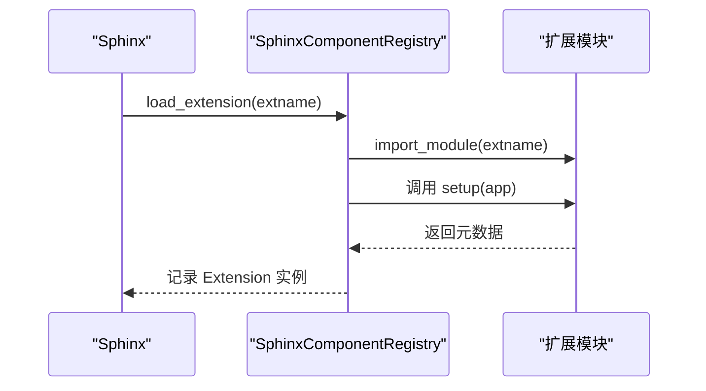
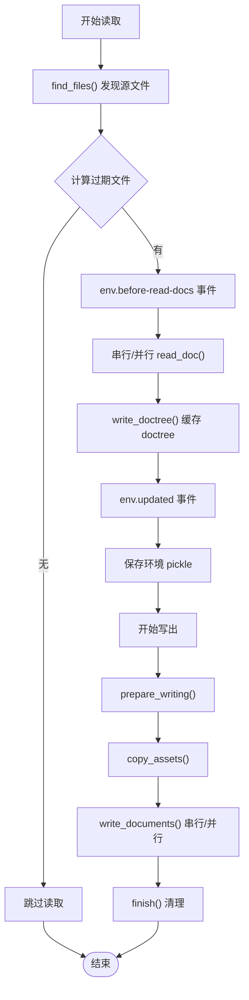
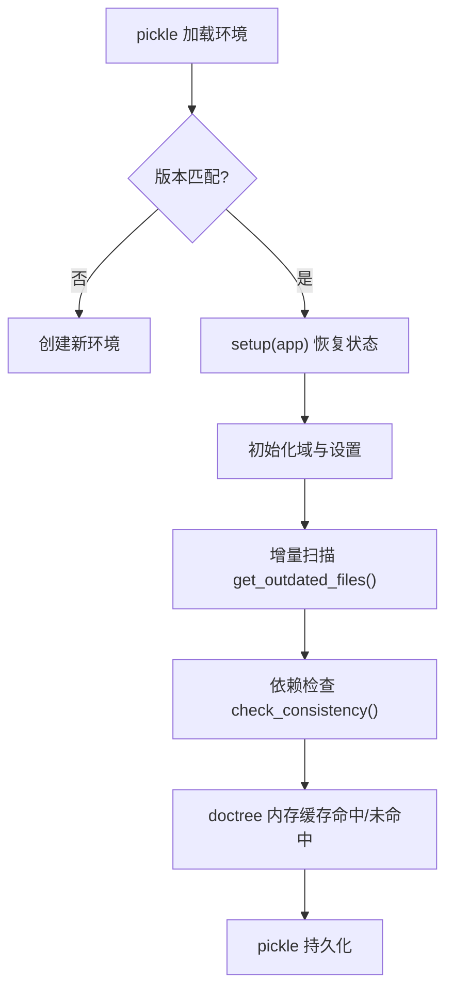
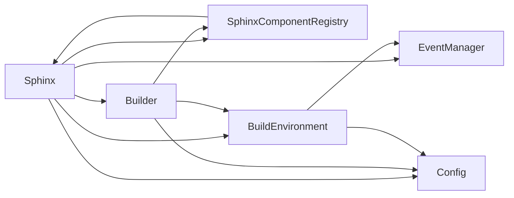

# 核心架构

<cite>
**本文引用的文件**
- [application.py](file://sphinx/application.py)
- [events.py](file://sphinx/events.py)
- [extension.py](file://sphinx/extension.py)
- [registry.py](file://sphinx/registry.py)
- [environment/__init__.py](file://sphinx/environment/__init__.py)
- [builders/__init__.py](file://sphinx/builders/__init__.py)
- [config.py](file://sphinx/config.py)
- [build_phase.py](file://sphinx/util/build_phase.py)
- [__init__.py](file://sphinx/__init__.py)
- [cmd/build.py](file://sphinx/cmd/build.py)
</cite>

## 目录
1. [引言](#引言)
2. [项目结构](#项目结构)
3. [核心组件](#核心组件)
4. [架构总览](#架构总览)
5. [详细组件分析](#详细组件分析)
6. [依赖分析](#依赖分析)
7. [性能考虑](#性能考虑)
8. [故障排查指南](#故障排查指南)
9. [结论](#结论)
10. [附录](#附录)

## 引言
本文件面向 Sphinx 核心架构，系统性阐述应用架构设计、Application 类的职责与生命周期管理、组件注册机制与插件系统、事件驱动架构、数据流与组件交互、构建环境管理与缓存策略，并提供多类架构图与组件关系图，帮助开发者快速理解整体设计并进行扩展开发。

## 项目结构
Sphinx 的核心代码集中在 sphinx 包内，围绕 Application、事件系统、组件注册表、构建器、环境与配置等模块协同工作。命令行入口通过 cmd/build.py 调用 Application 完成构建流程；Application 负责初始化配置、加载扩展、创建构建器与环境，并在事件驱动下完成构建。

**图表来源**
- [cmd/build.py:1-200](file://sphinx/cmd/build.py#L1-L200)
- [application.py:148-354](file://sphinx/application.py#L148-L354)
- [registry.py:72-628](file://sphinx/registry.py#L72-L628)
- [events.py:72-486](file://sphinx/events.py#L72-L486)
- [config.py:196-915](file://sphinx/config.py#L196-L915)
- [environment/__init__.py:101-800](file://sphinx/environment/__init__.py#L101-L800)
- [builders/__init__.py:64-891](file://sphinx/builders/__init__.py#L64-L891)

**章节来源**
- [cmd/build.py:1-200](file://sphinx/cmd/build.py#L1-L200)
- [application.py:148-354](file://sphinx/application.py#L148-L354)
- [registry.py:72-628](file://sphinx/registry.py#L72-L628)
- [events.py:72-486](file://sphinx/events.py#L72-L486)
- [config.py:196-915](file://sphinx/config.py#L196-L915)
- [environment/__init__.py:101-800](file://sphinx/environment/__init__.py#L101-L800)
- [builders/__init__.py:64-891](file://sphinx/builders/__init__.py#L64-L891)

## 核心组件
- Application（Sphinx）：应用入口与控制中枢，负责初始化配置、加载扩展、创建构建器与环境、触发事件、协调构建流程。
- EventManager：事件系统，提供事件注册、分发与异常处理，支持优先级与允许的异常白名单。
- SphinxComponentRegistry：组件注册表，集中管理构建器、域、指令、角色、变换、翻译器等组件的注册与创建。
- BuildEnvironment：构建环境，维护文档清单、依赖、交叉引用、搜索索引、域数据等，支持增量构建与一致性检查。
- Builder：构建器抽象，定义构建阶段、写入策略、并行能力与输出格式，协调读取与写出过程。
- Config：配置系统，提供配置项定义、类型校验、重建影响标记与序列化支持。

**章节来源**
- [application.py:148-354](file://sphinx/application.py#L148-L354)
- [events.py:72-486](file://sphinx/events.py#L72-L486)
- [registry.py:72-628](file://sphinx/registry.py#L72-L628)
- [environment/__init__.py:101-800](file://sphinx/environment/__init__.py#L101-L800)
- [builders/__init__.py:64-891](file://sphinx/builders/__init__.py#L64-L891)
- [config.py:196-915](file://sphinx/config.py#L196-L915)

## 架构总览
Sphinx 采用“应用中心 + 事件驱动 + 组件注册表”的架构模式。Application 在启动时加载内置与用户扩展，创建并初始化构建器与环境，随后在事件驱动下执行构建流程。构建器负责具体的读取与写出，环境负责增量与一致性，注册表统一管理可扩展组件。

**图表来源**
- [application.py:148-354](file://sphinx/application.py#L148-L354)
- [events.py:72-486](file://sphinx/events.py#L72-L486)
- [registry.py:72-628](file://sphinx/registry.py#L72-L628)
- [environment/__init__.py:101-800](file://sphinx/environment/__init__.py#L101-L800)
- [builders/__init__.py:64-891](file://sphinx/builders/__init__.py#L64-L891)
- [config.py:196-915](file://sphinx/config.py#L196-L915)

## 详细组件分析

### Application 类与生命周期
- 初始化阶段：解析目录、校验参数、设置日志、读取配置、国际化初始化、版本需求检查、加载内置与用户扩展、预加载构建器、创建 Project、初始化/加载 BuildEnvironment、创建并初始化 Builder。
- 构建阶段：根据参数选择全量、指定文件或增量构建，触发事件，保存环境，一致性检查，解析与写出文档，清理资源。
- 生命周期关键点：事件“config-inited”、“builder-inited”、“build-finished”，以及与环境相关的多个事件贯穿构建流程。

**图表来源**
- [application.py:165-354](file://sphinx/application.py#L165-L354)
- [builders/__init__.py:389-577](file://sphinx/builders/__init__.py#L389-L577)
- [environment/__init__.py:485-577](file://sphinx/environment/__init__.py#L485-L577)

**章节来源**
- [application.py:165-354](file://sphinx/application.py#L165-L354)
- [builders/__init__.py:389-577](file://sphinx/builders/__init__.py#L389-L577)
- [environment/__init__.py:485-577](file://sphinx/environment/__init__.py#L485-L577)

### 事件驱动架构
- EventManager 提供事件注册、断开、发射与首个结果发射接口，支持优先级排序与允许的异常白名单，确保扩展回调的可控性与健壮性。
- Application 暴露 connect 方法，覆盖核心事件与扩展事件，便于外部扩展订阅。
- 典型事件链路：配置初始化、构建器初始化、环境过期检测、文档读取、解析、合并信息、一致性检查、写出开始、构建完成等。

**图表来源**
- [events.py:363-486](file://sphinx/events.py#L363-L486)

**章节来源**
- [events.py:72-486](file://sphinx/events.py#L72-L486)
- [application.py:531-800](file://sphinx/application.py#L531-L800)

### 组件注册机制与插件系统
- 插件加载：SphinxComponentRegistry.load_extension 导入模块并调用其 setup(app)，返回扩展元数据（版本、并行安全标志等），记录到 Application.extensions。
- 构建器注册：add_builder/create_builder/preload_builder 支持内置与第三方构建器注册与动态加载。
- 域与指令：add_domain/add_directive_to_domain/add_role_to_domain 等方法将扩展组件注入标准域或新增域。
- 变换与翻译：add_transform/add_post_transform 与 add_translation_handlers 将 Docutils 变换与节点翻译器注入构建流程。
- 扩展版本要求：verify_needs_extensions 校验 needs_extensions 中声明的扩展版本满足度。

**图表来源**
- [registry.py:531-595](file://sphinx/registry.py#L531-L595)
- [extension.py:41-95](file://sphinx/extension.py#L41-L95)

**章节来源**
- [registry.py:72-628](file://sphinx/registry.py#L72-L628)
- [extension.py:41-95](file://sphinx/extension.py#L41-L95)

### 数据流与组件交互
- 读取阶段：Builder.read 调用 BuildEnvironment.find_files 获取待构建文档集合，计算过期文档，按顺序或并行读取，解析为 doctree 并写入 doctree 缓存。
- 解析与合并：apply_post_transforms 应用后变换，resolve_toctree 与 resolve_references 处理目录树与交叉引用。
- 写出阶段：prepare_writing/copy_assets/write_documents，支持串行与并行写出，最终 finish。
- 环境持久化：pickle 保存 BuildEnvironment，用于增量构建。

**图表来源**
- [builders/__init__.py:469-750](file://sphinx/builders/__init__.py#L469-L750)
- [environment/__init__.py:485-577](file://sphinx/environment/__init__.py#L485-L577)

**章节来源**
- [builders/__init__.py:469-750](file://sphinx/builders/__init__.py#L469-L750)
- [environment/__init__.py:485-577](file://sphinx/environment/__init__.py#L485-L577)

### 构建环境管理与缓存策略
- 环境版本与一致性：ENV_VERSION 标记环境属性变更，pickle 时清理临时字段；版本不匹配或源目录变化会触发错误。
- 增量构建：get_outdated_files 基于时间戳、依赖与配置变更判断新增/修改/移除文档；check_dependents 通过事件扩展依赖传播。
- doctree 缓存：内存缓存 _pickled_doctree_cache 与 _write_doc_doctree_cache 减少重复读取；write_doctree 持久化至 doctreedir。
- 国际化与消息目录：CatalogRepository 与 mo 文件依赖，确保翻译更新时重新处理相关文档。

**图表来源**
- [environment/__init__.py:242-283](file://sphinx/environment/__init__.py#L242-L283)
- [environment/__init__.py:521-554](file://sphinx/environment/__init__.py#L521-L554)
- [environment/__init__.py:650-717](file://sphinx/environment/__init__.py#L650-L717)

**章节来源**
- [environment/__init__.py:242-283](file://sphinx/environment/__init__.py#L242-L283)
- [environment/__init__.py:521-554](file://sphinx/environment/__init__.py#L521-L554)
- [environment/__init__.py:650-717](file://sphinx/environment/__init__.py#L650-L717)

### 构建阶段与并行策略
- BuildPhase：INITIALIZATION → READING → CONSISTENCY_CHECK → RESOLVING → WRITING，贯穿构建器各阶段。
- 并行：Builder.read/_read_parallel 与 Builder.write/_write_parallel 支持多进程并行读取与写出，受应用并行参数与扩展并行安全标志控制。

**章节来源**
- [build_phase.py:8-16](file://sphinx/util/build_phase.py#L8-L16)
- [builders/__init__.py:517-630](file://sphinx/builders/__init__.py#L517-L630)
- [builders/__init__.py:779-800](file://sphinx/builders/__init__.py#L779-L800)

## 依赖分析
- Application 依赖 EventManager、SphinxComponentRegistry、Config、BuildEnvironment、Builder。
- Builder 依赖 SphinxComponentRegistry、BuildEnvironment、Config、Tags。
- BuildEnvironment 依赖 Project、Config、EventManager、域容器与变换。
- Registry 依赖扩展模块的 setup 返回元数据，统一注册各类组件。
- Config 为全局配置中心，被 Application、Environment、Builder 广泛使用。

**图表来源**
- [application.py:148-354](file://sphinx/application.py#L148-L354)
- [registry.py:72-628](file://sphinx/registry.py#L72-L628)
- [events.py:72-486](file://sphinx/events.py#L72-L486)
- [config.py:196-915](file://sphinx/config.py#L196-L915)
- [environment/__init__.py:101-800](file://sphinx/environment/__init__.py#L101-L800)
- [builders/__init__.py:64-891](file://sphinx/builders/__init__.py#L64-L891)

**章节来源**
- [application.py:148-354](file://sphinx/application.py#L148-L354)
- [registry.py:72-628](file://sphinx/registry.py#L72-L628)
- [events.py:72-486](file://sphinx/events.py#L72-L486)
- [config.py:196-915](file://sphinx/config.py#L196-L915)
- [environment/__init__.py:101-800](file://sphinx/environment/__init__.py#L101-L800)
- [builders/__init__.py:64-891](file://sphinx/builders/__init__.py#L64-L891)

## 性能考虑
- 并行读取与写出：在支持的构建器上启用并行，显著缩短大型项目的构建时间。
- doctree 缓存：内存缓存与磁盘持久化减少重复解析与序列化开销。
- 增量构建：基于时间戳与依赖的最小化重读与重写，避免全量重建。
- 环境版本与一致性：严格的版本与一致性检查防止不一致状态导致的重复工作。

[本节为通用指导，无需特定文件引用]

## 故障排查指南
- 版本不兼容：当扩展或环境版本不匹配时，抛出版本相关错误，需升级或降级以满足需求。
- 配置不可序列化：包含函数、类或模块对象的配置值无法缓存，会触发警告，建议改为可序列化形式或移除。
- 未知事件名：尝试连接不存在的事件名会抛出 ExtensionError，确认事件名称与扩展是否正确注册。
- 构建失败：构建结束后触发 build-finished 事件，若异常被捕获则删除已保存环境文件以强制下次全量构建。

**章节来源**
- [extension.py:41-95](file://sphinx/extension.py#L41-L95)
- [events.py:363-486](file://sphinx/events.py#L363-L486)
- [builders/__init__.py:420-467](file://sphinx/builders/__init__.py#L420-L467)

## 结论
Sphinx 的核心架构以 Application 为中心，通过事件驱动与组件注册表实现高度可扩展与可维护的文档生成体系。Application 负责生命周期管理与流程编排，EventManager 提供稳定的扩展点，Registry 统一注册与创建各类组件，Environment 与 Builder 则分别承担增量构建与具体输出任务。该设计既保证了灵活性，又提供了清晰的数据流与缓存策略，适合大规模项目与复杂生态的持续演进。

[本节为总结性内容，无需特定文件引用]

## 附录
- 版本信息：Sphinx 版本号与显示版本由包级 __init__.py 提供。
- 命令行入口：cmd/build.py 提供 sphinx-build 的命令行解析与异常处理。

**章节来源**
- [__init__.py:14-49](file://sphinx/__init__.py#L14-L49)
- [cmd/build.py:31-50](file://sphinx/cmd/build.py#L31-L50)