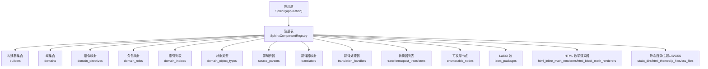
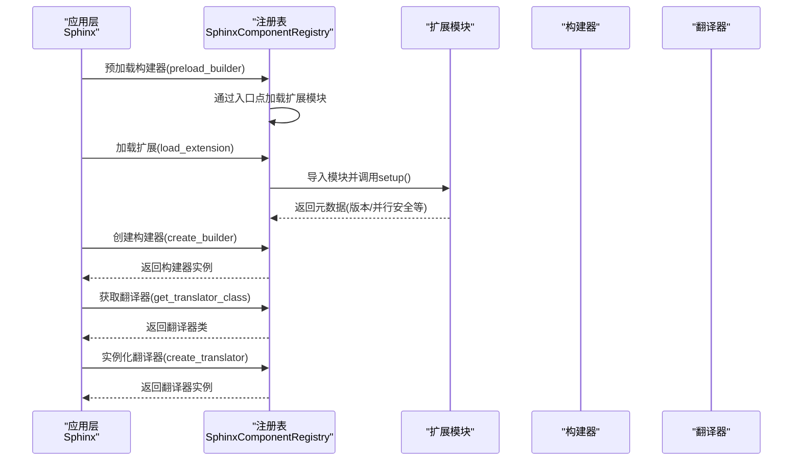
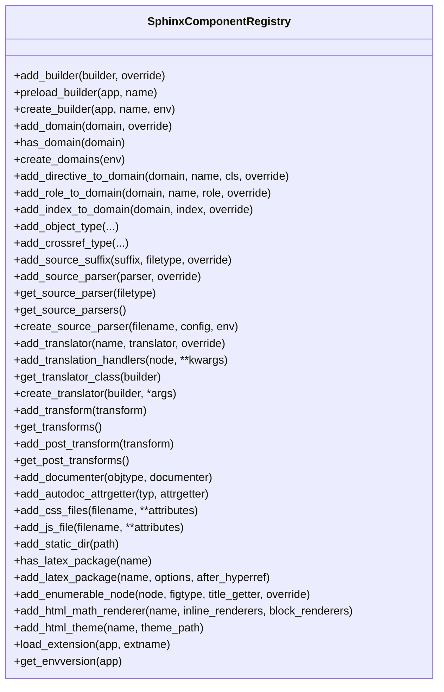
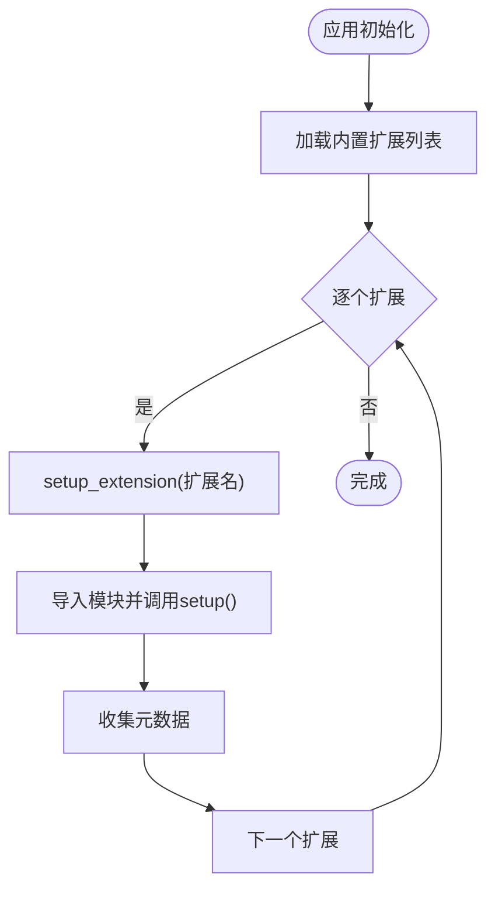
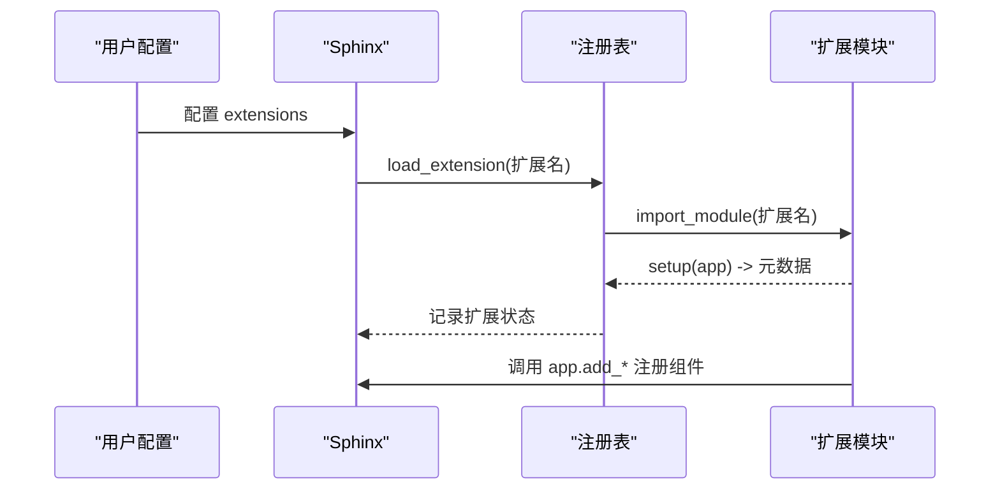
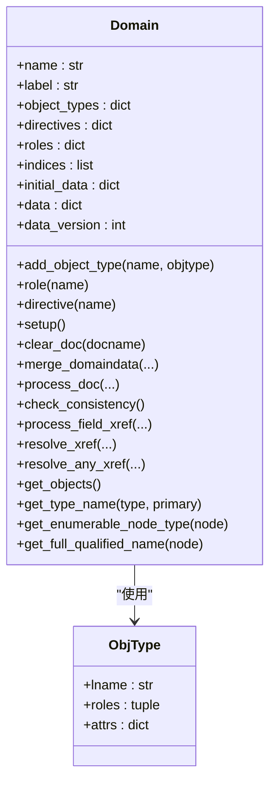
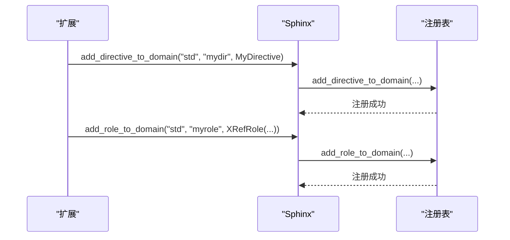
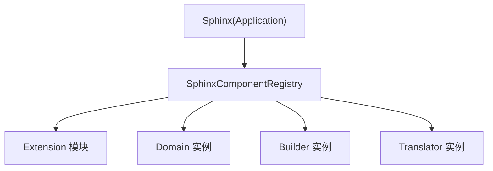

# 组件注册系统

<cite>
**本文档引用的文件**
- [registry.py](file://sphinx/registry.py)
- [application.py](file://sphinx/application.py)
- [extension.py](file://sphinx/extension.py)
- [domains/__init__.py](file://sphinx/domains/__init__.py)
- [directives/__init__.py](file://sphinx/directives/__init__.py)
- [roles.py](file://sphinx/roles.py)
- [ext/autosectionlabel.py](file://sphinx/ext/autosectionlabel.py)
- [ext/coverage.py](file://sphinx/ext/coverage.py)
</cite>

## 目录
1. [简介](#简介)
2. [项目结构](#项目结构)
3. [核心组件](#核心组件)
4. [架构总览](#架构总览)
5. [详细组件分析](#详细组件分析)
6. [依赖关系分析](#依赖关系分析)
7. [性能考虑](#性能考虑)
8. [故障排除指南](#故障排除指南)
9. [结论](#结论)
10. [附录](#附录)

## 简介
本文件系统性阐述 Sphinx 的组件注册系统，重点围绕 SphinxComponentRegistry 类的设计理念与实现机制，覆盖组件注册、查找与管理的完整流程；解释内置扩展的自动加载机制与第三方扩展的注册方式；梳理组件类型的分类与管理策略（构建器、域、指令、角色等）；并提供最佳实践与常见问题的解决方案，辅以具体示例路径帮助读者快速上手。

## 项目结构
Sphinx 的组件注册系统主要由以下模块协同完成：
- 应用层入口：SphinxApplication 负责初始化、加载内置扩展、用户扩展与构建器，并协调注册表。
- 注册表：SphinxComponentRegistry 统一管理各类组件（构建器、域、指令、角色、转换器、数学渲染器等）。
- 扩展框架：Extension 类承载扩展元数据，verify_needs_extensions 校验版本需求。
- 域与对象类型：Domain 抽象出语义域，ObjType 描述对象类型及其角色映射。
- 指令与角色：标准指令与角色实现，以及跨引用角色（XRefRole）等。

图表来源
- [application.py:78-141](file://sphinx/application.py#L78-L141)
- [registry.py:72-155](file://sphinx/registry.py#L72-L155)

章节来源
- [application.py:78-141](file://sphinx/application.py#L78-L141)
- [registry.py:72-155](file://sphinx/registry.py#L72-L155)

## 核心组件
本节聚焦 SphinxComponentRegistry 的职责边界与关键数据结构，说明其如何统一管理组件生命周期与依赖关系。

- 构建器管理：维护 builder 名称到类的映射，支持预加载与实例化。
- 域管理：维护域名称到类的映射，运行时创建域实例并将扩展注入的指令/角色/索引/对象类型合并到域中。
- 指令与角色：按域维度注册指令与角色，支持覆盖策略。
- 对象类型与交叉引用：通过 add_object_type/add_crossref_type 快速在标准域 std 中注册对象类型与交叉引用类型。
- 源解析器与后缀：维护文件后缀到文件类型的映射，以及解析器类映射。
- 翻译器与节点处理：维护构建器到翻译器类的映射，以及自定义节点的访问器/离开器函数。
- 转换器：维护全局与后置转换器列表。
- 可枚举节点：记录可编号节点类型及其标题获取器。
- LaTeX/HTML 资源：维护 LaTeX 宏包、HTML 主题、JS/CSS 文件等资源注册。
- 扩展加载：统一加载扩展模块，调用 setup 并收集元数据。

章节来源
- [registry.py:72-155](file://sphinx/registry.py#L72-L155)
- [registry.py:160-527](file://sphinx/registry.py#L160-L527)

## 架构总览
下图展示了从应用启动到组件可用的关键流程：应用初始化内置扩展与用户扩展，预加载构建器，创建构建器与翻译器，最终驱动构建过程。

图表来源
- [application.py:292-302](file://sphinx/application.py#L292-L302)
- [application.py:418-426](file://sphinx/application.py#L418-L426)
- [registry.py:531-594](file://sphinx/registry.py#L531-L594)

章节来源
- [application.py:292-302](file://sphinx/application.py#L292-L302)
- [application.py:418-426](file://sphinx/application.py#L418-L426)
- [registry.py:531-594](file://sphinx/registry.py#L531-L594)

## 详细组件分析

### SphinxComponentRegistry 类设计与实现
- 设计理念
  - 单一职责：集中管理所有可扩展组件，提供统一的注册、查询与实例化接口。
  - 松耦合：通过字符串键（如域名、构建器名、节点名）进行组件解耦。
  - 可扩展：支持第三方扩展通过 setup() 提供组件注册能力。
  - 版本与兼容：内置黑名单与版本校验，避免冲突与不兼容扩展加载。
- 关键数据结构
  - builders、domains、source_parsers、translators、translation_handlers、transforms、post_transforms、enumerable_nodes、latex_packages、html_themes、js_files、css_files、static_dirs 等。
- 错误处理
  - 重复注册抛出 ExtensionError；未注册组件抛出 SphinxError；导入失败记录详细追踪信息。
- 性能特性
  - 字典查找为主，时间复杂度 O(1)；实例化延迟到实际需要时触发。

图表来源
- [registry.py:72-627](file://sphinx/registry.py#L72-L627)

章节来源
- [registry.py:72-627](file://sphinx/registry.py#L72-L627)

### 内置扩展自动加载机制
- 应用初始化时，会遍历内置扩展列表并逐个加载，确保核心功能可用。
- 内置扩展涵盖构建器、域、指令、角色、转换器、解析器、环境收集器等。
- 第三方扩展通过配置项或显式调用加载，遵循相同注册流程。

图表来源
- [application.py:292-299](file://sphinx/application.py#L292-L299)
- [registry.py:531-594](file://sphinx/registry.py#L531-L594)

章节来源
- [application.py:292-299](file://sphinx/application.py#L292-L299)
- [registry.py:531-594](file://sphinx/registry.py#L531-L594)

### 第三方扩展注册方式
- 通过配置项（如 conf.py 中的 extensions 列表）声明扩展。
- 在扩展模块中提供 setup(app) 函数，返回扩展元数据字典。
- 扩展内部通过 app.add_* 方法注册组件（如 add_directive、add_role、add_domain 等）。

图表来源
- [application.py:298-299](file://sphinx/application.py#L298-L299)
- [registry.py:531-594](file://sphinx/registry.py#L531-L594)

章节来源
- [application.py:298-299](file://sphinx/application.py#L298-L299)
- [registry.py:531-594](file://sphinx/registry.py#L531-L594)

### 组件类型分类与管理策略
- 构建器（Builder）
  - 通过 add_builder 注册，name 属性必须存在；支持 override 强制替换。
  - 预加载通过入口点 group='sphinx.builders' 解析。
- 域（Domain）
  - 通过 add_domain 注册；运行时 create_domains 将扩展注入的指令/角色/索引/对象类型合并到域实例。
- 指令（Directive）
  - 通过 add_directive_to_domain 或 add_directive 注册；支持覆盖策略。
- 角色（Role）
  - 通过 add_role_to_domain 或 add_role 注册；XRefRole 支持通用交叉引用。
- 源解析器（Parser）
  - 通过 add_source_parser 注册；按文件类型映射到解析器类。
- 翻译器（Translator）
  - 通过 add_translator 注册；create_translator 时将自定义节点处理器注入实例。
- 转换器（Transform）
  - 通过 add_transform/add_post_transform 注册；分别在不同阶段执行。
- 可枚举节点（Enumerable Node）
  - 通过 add_enumerable_node 注册，支持编号与引用。
- LaTeX/HTML 资源
  - 通过 add_latex_package、add_html_theme、add_js_file、add_css_files、add_static_dir 等注册。

章节来源
- [registry.py:160-527](file://sphinx/registry.py#L160-L527)
- [domains/__init__.py:62-136](file://sphinx/domains/__init__.py#L62-L136)
- [roles.py:43-180](file://sphinx/roles.py#L43-L180)

### 域与对象类型管理
- Domain 抽象了语义域，包含 object_types、directives、roles、indices 等类变量，运行时实例化后转为实例变量。
- SphinxComponentRegistry.create_domains 会将扩展注入的组件合并到域实例中，确保域功能可增量扩展。
- ObjType 描述对象类型及其关联的角色，支持搜索优先级等属性。

图表来源
- [domains/__init__.py:62-332](file://sphinx/domains/__init__.py#L62-L332)

章节来源
- [domains/__init__.py:62-332](file://sphinx/domains/__init__.py#L62-L332)

### 指令与角色注册流程
- 指令注册：add_directive_to_domain 将指令类注册到指定域；add_directive 注册到全局指令表。
- 角色注册：add_role_to_domain 将角色函数或 XRefRole 注册到指定域；add_role 注册到全局角色表。
- XRefRole：通用交叉引用角色，支持规范化标题、目标、警告等行为。

图表来源
- [registry.py:220-266](file://sphinx/registry.py#L220-L266)
- [roles.py:43-180](file://sphinx/roles.py#L43-L180)

章节来源
- [registry.py:220-266](file://sphinx/registry.py#L220-L266)
- [roles.py:43-180](file://sphinx/roles.py#L43-L180)

### 示例：注册自定义组件与扩展现有功能
- 自定义指令
  - 在扩展模块中定义指令类，然后在 setup 中调用 app.add_directive 或 app.add_directive_to_domain。
  - 参考路径：[directives/__init__.py:1066-1120](file://sphinx/directives/__init__.py#L1066-L1120)
- 自定义角色
  - 定义角色函数或继承 XRefRole，在 setup 中调用 app.add_role 或 app.add_role_to_domain。
  - 参考路径：[roles.py:630-650](file://sphinx/roles.py#L630-L650)
- 自定义域
  - 定义 Domain 子类并在 setup 中调用 app.add_domain。
  - 参考路径：[domains/__init__.py:62-136](file://sphinx/domains/__init__.py#L62-L136)
- 扩展现有功能
  - 使用 app.connect 连接事件，或通过 app.add_node/app.add_enumerable_node 注册自定义节点。
  - 参考路径：[application.py:975-1064](file://sphinx/application.py#L975-L1064)

章节来源
- [directives/__init__.py:1066-1120](file://sphinx/directives/__init__.py#L1066-L1120)
- [roles.py:630-650](file://sphinx/roles.py#L630-L650)
- [domains/__init__.py:62-136](file://sphinx/domains/__init__.py#L62-L136)
- [application.py:975-1064](file://sphinx/application.py#L975-L1064)

## 依赖关系分析
- 应用层与注册表：Sphinx 持有 SphinxComponentRegistry 实例，负责协调扩展加载与组件创建。
- 注册表与扩展：通过 import_module 动态导入扩展模块并调用 setup，收集元数据。
- 注册表与域：create_domains 将扩展注入的组件合并到域实例，形成最终可用的域。
- 注册表与构建器：preload_builder 通过入口点解析扩展模块，确保构建器可用。

图表来源
- [application.py:292-302](file://sphinx/application.py#L292-L302)
- [registry.py:531-594](file://sphinx/registry.py#L531-L594)

章节来源
- [application.py:292-302](file://sphinx/application.py#L292-L302)
- [registry.py:531-594](file://sphinx/registry.py#L531-L594)

## 性能考虑
- 注册表采用字典存储，组件查找与注册均为 O(1)，适合高频访问场景。
- 构建器与翻译器实例化延迟到实际构建阶段，减少初始化开销。
- 扩展加载采用惰性策略，仅在需要时导入模块并调用 setup。
- 大量并行构建时，建议扩展明确声明 parallel_read_safe/parallel_write_safe，避免不必要的警告与降级。

## 故障排除指南
- 扩展导入失败
  - 现象：ExtensionError，提示无法导入扩展。
  - 排查：确认扩展模块路径正确、setup 函数存在且签名正确。
  - 参考路径：[registry.py:550-555](file://sphinx/registry.py#L550-L555)
- 重复注册组件
  - 现象：ExtensionError，提示组件已存在。
  - 排查：检查是否重复注册同一名称的组件；必要时启用 override。
  - 参考路径：[registry.py:166-171](file://sphinx/registry.py#L166-L171)
- 未注册的构建器或解析器
  - 现象：SphinxError，提示未注册。
  - 排查：确认构建器名称正确或解析器支持的文件类型映射正确。
  - 参考路径：[registry.py:193-196](file://sphinx/registry.py#L193-L196)、[registry.py:364-370](file://sphinx/registry.py#L364-L370)
- 版本不满足需求
  - 现象：VersionRequirementError。
  - 排查：检查 needs_extensions 配置与扩展版本；或升级/降级扩展。
  - 参考路径：[extension.py:50-84](file://sphinx/extension.py#L50-L84)

章节来源
- [registry.py:166-171](file://sphinx/registry.py#L166-L171)
- [registry.py:193-196](file://sphinx/registry.py#L193-L196)
- [registry.py:364-370](file://sphinx/registry.py#L364-L370)
- [extension.py:50-84](file://sphinx/extension.py#L50-L84)

## 结论
SphinxComponentRegistry 通过集中化的组件注册与管理，实现了对构建器、域、指令、角色、解析器、转换器等的统一调度。结合内置扩展的自动加载与第三方扩展的灵活注册机制，Sphinx 形成了高度可扩展且稳定的文档生成体系。遵循本文的最佳实践与排错指南，可以高效地扩展与定制 Sphinx 的功能。

## 附录

### 最佳实践
- 明确扩展元数据：在扩展的 setup 中返回清晰的元数据（version、parallel_*），便于并行构建与版本校验。
- 合理使用覆盖策略：仅在确需替换默认实现时启用 override，避免破坏默认行为。
- 事件驱动扩展：优先使用 app.connect 连接事件，而非直接修改核心组件。
- 自定义节点与翻译器：通过 app.add_node 与 app.set_translator 注册，确保输出格式一致。
- 域与对象类型：使用 add_object_type/add_crossref_type 快速扩展标准域，保持命名一致性。

### 常见问题与解决方案
- 如何在扩展中注册自定义指令/角色？
  - 参考：[directives/__init__.py:1066-1120](file://sphinx/directives/__init__.py#L1066-L1120)、[roles.py:630-650](file://sphinx/roles.py#L630-L650)
- 如何扩展现有域的功能？
  - 参考：[domains/__init__.py:62-136](file://sphinx/domains/__init__.py#L62-L136)
- 如何注册自定义构建器？
  - 参考：[application.py:874-884](file://sphinx/application.py#L874-L884)
- 如何注册自定义翻译器与节点处理器？
  - 参考：[application.py:952-973](file://sphinx/application.py#L952-L973)、[application.py:975-1028](file://sphinx/application.py#L975-L1028)