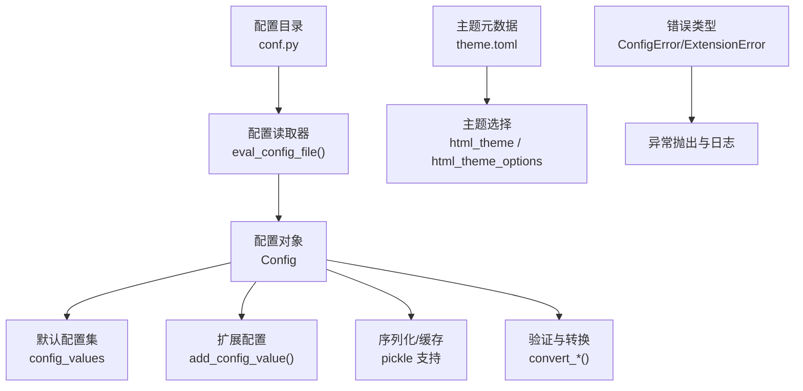
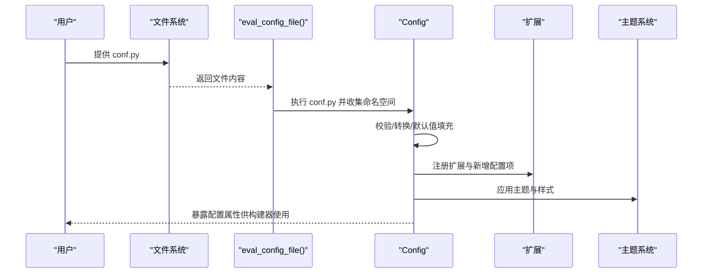
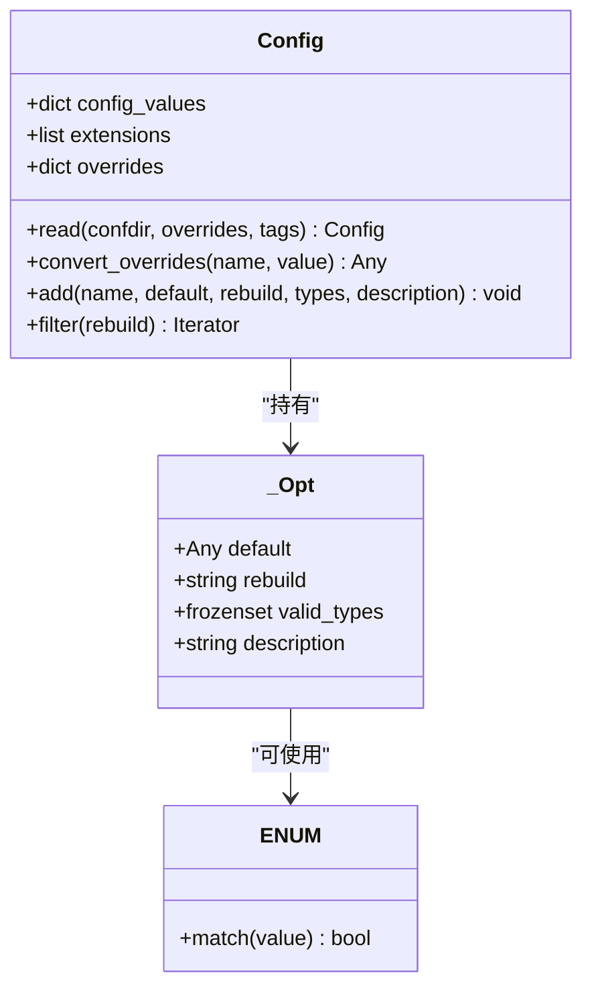
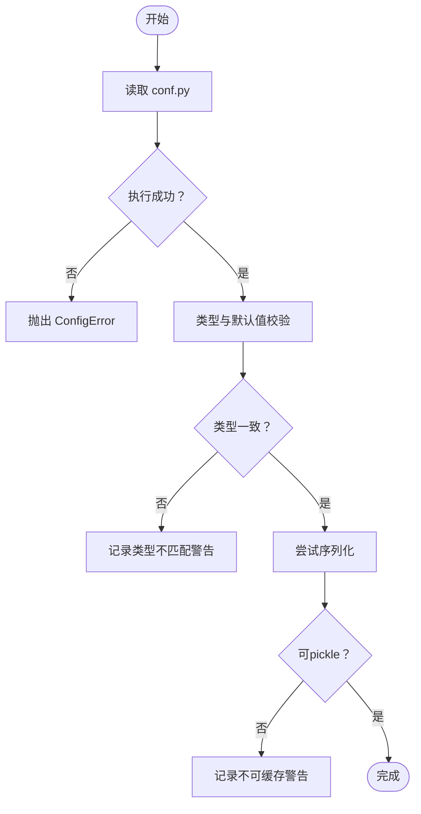
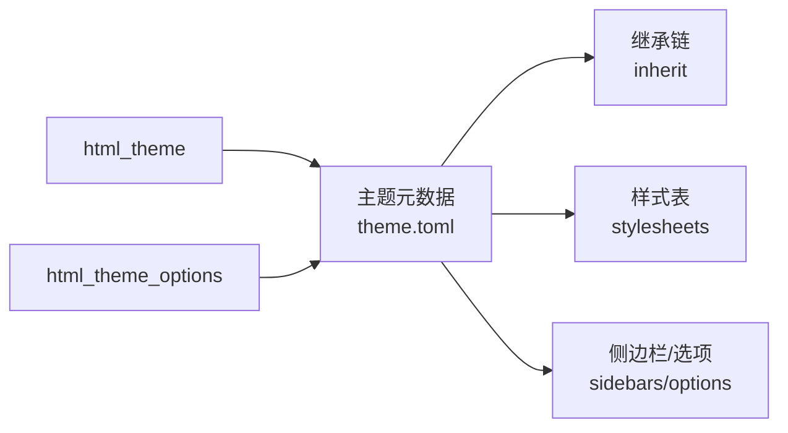
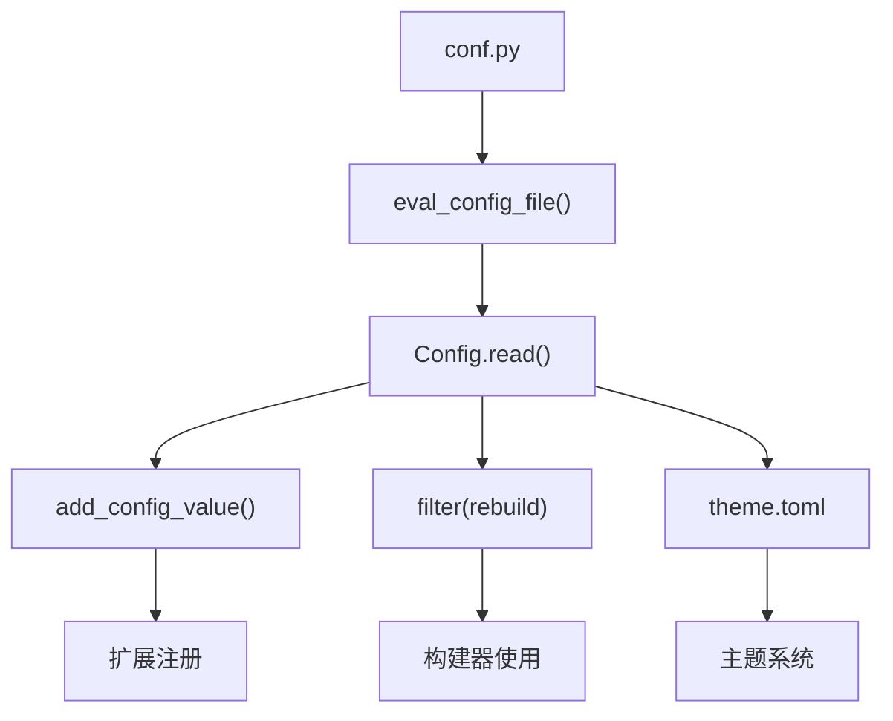

# 配置系统

<cite>
**本文引用的文件**
- [doc/conf.py](file://doc/conf.py)
- [sphinx/config.py](file://sphinx/config.py)
- [doc/usage/configuration.rst](file://doc/usage/configuration.rst)
- [doc/usage/theming.rst](file://doc/usage/theming.rst)
- [sphinx/themes/basic/theme.toml](file://sphinx/themes/basic/theme.toml)
- [sphinx/themes/sphinxdoc/theme.toml](file://sphinx/themes/sphinxdoc/theme.toml)
- [doc/_themes/sphinx13/theme.toml](file://doc/_themes/sphinx13/theme.toml)
- [sphinx/errors.py](file://sphinx/errors.py)
- [tests/test_config/test_config.py](file://tests/test_config/test_config.py)
- [tests/test_builders/test_build_warnings.py](file://tests/test_builders/test_build_warnings.py)
- [doc/usage/extensions/ifconfig.rst](file://doc/usage/extensions/ifconfig.rst)
</cite>

## 目录
1. [简介](#简介)
2. [项目结构](#项目结构)
3. [核心组件](#核心组件)
4. [架构总览](#架构总览)
5. [详细组件分析](#详细组件分析)
6. [依赖关系分析](#依赖关系分析)
7. [性能考量](#性能考量)
8. [故障排查指南](#故障排查指南)
9. [结论](#结论)
10. [附录](#附录)

## 简介
本文件系统性阐述 Sphinx 配置系统：从 conf.py 的作用与配置文件结构，到内置配置项的完整参考、输出格式与主题选择、高级配置技巧（条件配置、动态配置、配置继承），再到配置验证机制与错误处理、常见场景示例以及性能优化与调试方法。目标是帮助从初学者到高级用户都能高效、安全地定制 Sphinx 构建。

## 项目结构
- 配置文件入口：项目根目录下的 conf.py（在文档站点中为 doc/conf.py）。
- 配置解析与类型系统：位于 sphinx/config.py，负责读取、校验、序列化与默认值管理。
- 文档参考：doc/usage/configuration.rst 提供详尽的配置项说明；doc/usage/theming.rst 覆盖主题与样式。
- 主题元数据：sphinx/themes/*/theme.toml 定义主题继承、样式表与可选参数；doc/_themes/sphinx13/theme.toml 展示自定义主题示例。
- 错误与异常：sphinx/errors.py 定义配置相关异常类型。
- 测试与验证：tests/test_config/test_config.py 与 tests/test_builders/test_build_warnings.py 提供覆盖测试与缓存警告用例。

图表来源
- [sphinx/config.py:565-613](file://sphinx/config.py#L565-L613)
- [sphinx/config.py:196-563](file://sphinx/config.py#L196-L563)
- [sphinx/themes/basic/theme.toml:1-24](file://sphinx/themes/basic/theme.toml#L1-L24)
- [doc/_themes/sphinx13/theme.toml:1-5](file://doc/_themes/sphinx13/theme.toml#L1-L5)

章节来源
- [doc/conf.py:1-373](file://doc/conf.py#L1-L373)
- [sphinx/config.py:196-563](file://sphinx/config.py#L196-L563)
- [doc/usage/configuration.rst:23-72](file://doc/usage/configuration.rst#L23-L72)

## 核心组件
- 配置文件 conf.py
  - 必须位于配置目录，作为构建配置文件，包含几乎全部定制行为。
  - 可执行任意 Python 代码，Sphinx 在构建时执行该文件并从命名空间读取配置键。
  - 建议仅保留简单可序列化的值，避免不可 pickle 对象导致缓存问题。
- 配置对象 Config
  - 统一承载所有配置项，默认值、类型约束、重建触发范围（rebuild）均在此定义。
  - 支持命令行覆盖、字典/列表/布尔值等类型转换，以及扩展添加新配置项。
- 主题系统
  - 通过 html_theme 选择主题，html_theme_options 注入主题特定参数。
  - 主题元数据 theme.toml 描述继承链、样式表与可选参数，实现主题复用与定制。

章节来源
- [doc/usage/configuration.rst:23-72](file://doc/usage/configuration.rst#L23-L72)
- [sphinx/config.py:196-563](file://sphinx/config.py#L196-L563)
- [doc/usage/theming.rst:36-84](file://doc/usage/theming.rst#L36-L84)

## 架构总览
下图展示从 conf.py 到最终构建的关键流程：读取、评估、验证、序列化与应用。

图表来源
- [sphinx/config.py:585-613](file://sphinx/config.py#L585-L613)
- [sphinx/config.py:345-352](file://sphinx/config.py#L345-L352)
- [sphinx/config.py:494-511](file://sphinx/config.py#L494-L511)

## 详细组件分析

### 配置文件 conf.py 的作用与结构
- 位置与必要性：配置目录必须包含 conf.py；Sphinx 在构建时执行该文件以获取配置。
- 内容与限制：可包含扩展、模板路径、排除模式、项目信息、输出格式参数、国际化与主题等。
- 可执行性：conf.py 是 Python 代码，可进行复杂逻辑；但需注意可序列化性，避免函数/类/模块对象进入命名空间。
- 示例要点：文档站点中的 conf.py 展示了主题、静态资源、EPUB/LaTeX/Manpage 参数、国际化、链接检查等典型配置。

章节来源
- [doc/conf.py:12-26](file://doc/conf.py#L12-L26)
- [doc/conf.py:35-47](file://doc/conf.py#L35-L47)
- [doc/conf.py:79-109](file://doc/conf.py#L79-L109)
- [doc/conf.py:136-167](file://doc/conf.py#L136-L167)
- [doc/conf.py:169-173](file://doc/conf.py#L169-L173)
- [doc/conf.py:175-270](file://doc/conf.py#L175-L270)
- [doc/usage/configuration.rst:23-72](file://doc/usage/configuration.rst#L23-L72)

### 配置对象与类型系统
- 默认配置集：Config.config_values 定义了大量内置配置项及其默认值、重建范围与有效类型。
- 类型与转换：支持字符串、整数、布尔、列表、字典、枚举等；convert_overrides 将字符串覆盖转换为正确类型。
- 可序列化性：is_serializable 用于检测是否可被 pickle；不可序列化值会触发缓存警告。
- 扩展配置：add_config_value 允许扩展注册新配置项，并标准化 rebuild 与 valid_types。

图表来源
- [sphinx/config.py:196-563](file://sphinx/config.py#L196-L563)
- [sphinx/config.py:97-194](file://sphinx/config.py#L97-L194)
- [sphinx/config.py:75-94](file://sphinx/config.py#L75-L94)

章节来源
- [sphinx/config.py:215-297](file://sphinx/config.py#L215-L297)
- [sphinx/config.py:354-400](file://sphinx/config.py#L354-L400)
- [sphinx/config.py:509-511](file://sphinx/config.py#L509-L511)

### 配置验证与错误处理
- 语法与运行时错误：conf.py 中的语法错误或调用 sys.exit() 会被捕获并包装为 ConfigError。
- 类型检查：check_confval_types 对配置值与默认值类型进行一致性检查，发出警告。
- 缓存警告：当配置值不可序列化时，触发“无法缓存不可pickle配置值”的警告。
- 异常类型：ConfigError、ExtensionError 等由 sphinx/errors.py 定义，统一错误分类。

图表来源
- [sphinx/config.py:585-613](file://sphinx/config.py#L585-L613)
- [sphinx/config.py:777-800](file://sphinx/config.py#L777-L800)
- [tests/test_builders/test_build_warnings.py:121-140](file://tests/test_builders/test_build_warnings.py#L121-L140)

章节来源
- [sphinx/errors.py:81-84](file://sphinx/errors.py#L81-L84)
- [tests/test_config/test_config.py:484-493](file://tests/test_config/test_config.py#L484-L493)
- [tests/test_builders/test_build_warnings.py:121-140](file://tests/test_builders/test_build_warnings.py#L121-L140)

### 输出格式与主题选择
- HTML 主题：通过 html_theme 选择内置或自定义主题；html_theme_options 注入主题参数。
- 主题元数据：theme.toml 定义继承关系、样式表与可选参数；basic 为主题基类，sphinxdoc 继承 basic。
- 自定义主题：可放置于 html_theme_path，支持目录或 zip 包；文档站点示例使用 _themes/sphinx13。

图表来源
- [doc/usage/theming.rst:36-84](file://doc/usage/theming.rst#L36-L84)
- [sphinx/themes/basic/theme.toml:1-24](file://sphinx/themes/basic/theme.toml#L1-L24)
- [sphinx/themes/sphinxdoc/theme.toml:1-7](file://sphinx/themes/sphinxdoc/theme.toml#L1-L7)
- [doc/_themes/sphinx13/theme.toml:1-5](file://doc/_themes/sphinx13/theme.toml#L1-L5)

章节来源
- [doc/usage/theming.rst:86-365](file://doc/usage/theming.rst#L86-L365)
- [doc/conf.py:35-47](file://doc/conf.py#L35-L47)

### 高级配置技巧
- 条件配置：sphinx.ext.ifconfig 基于配置表达式控制内容包含；可在 conf.py 的 setup 中通过 add_config_value 注册自定义配置。
- 动态配置：通过 add_config_value 注册可随环境变化的配置项；默认值可为可调用对象，延迟求值。
- 配置继承：主题通过 theme.toml 的 inherit 实现继承，子主题覆盖父主题样式与选项。

章节来源
- [doc/usage/extensions/ifconfig.rst:16-39](file://doc/usage/extensions/ifconfig.rst#L16-L39)
- [sphinx/config.py:494-511](file://sphinx/config.py#L494-L511)
- [sphinx/themes/basic/theme.toml:2](file://sphinx/themes/basic/theme.toml#L2)

### 常见配置场景示例
- 多语言支持：设置 language、locale_dirs、gettext_* 系列参数；结合 figure_language_filename 实现图片本地化。
- 自定义主题：设置 html_theme 与 html_theme_options；或通过 html_theme_path 引入第三方主题。
- 扩展启用：在 extensions 列表中加入所需扩展；对需要版本要求的扩展使用 needs_extensions。
- 链接检查与忽略：使用 linkcheck_* 系列参数调整超链接检查行为。

章节来源
- [doc/usage/configuration.rst:482-738](file://doc/usage/configuration.rst#L482-L738)
- [doc/conf.py:12-26](file://doc/conf.py#L12-L26)
- [doc/conf.py:169-173](file://doc/conf.py#L169-L173)
- [doc/conf.py:111-121](file://doc/conf.py#L111-L121)

## 依赖关系分析
- 配置文件到配置对象：conf.py 通过 eval_config_file() 被执行并生成命名空间，随后由 Config.read() 创建配置对象。
- 配置对象到扩展：Config.add() 使扩展能注册新配置项；扩展也可在 setup 中注册事件与处理器。
- 配置对象到主题：Config.filter() 与 rebuild 字段决定哪些配置影响 HTML 构建；主题元数据通过 theme.toml 影响样式与布局。

图表来源
- [sphinx/config.py:565-613](file://sphinx/config.py#L565-L613)
- [sphinx/config.py:345-352](file://sphinx/config.py#L345-L352)
- [sphinx/config.py:494-511](file://sphinx/config.py#L494-L511)

章节来源
- [sphinx/config.py:196-563](file://sphinx/config.py#L196-L563)

## 性能考量
- 避免不可序列化配置：函数、类、模块对象会导致缓存失败并触发警告，应删除或改用可序列化替代方案。
- 合理使用 nitpicky：开启 nitpicky 有助于早期发现引用问题，但可能增加构建时间与告警数量。
- 控制模板与静态资源：合理设置 templates_path 与 html_static_path，避免过多静态文件影响增量构建。
- 选择合适主题：内置主题通常更轻量，自定义主题若包含大量样式与脚本可能增加构建开销。

## 故障排查指南
- 配置语法错误：conf.py 中的语法错误会被捕获并抛出 ConfigError；检查报错位置与上下文。
- 不可缓存配置值：出现“无法缓存不可pickle配置值”警告时，检查命名空间中是否存在函数/类/模块对象。
- 类型不匹配：check_confval_types 会在类型不一致时发出警告；核对配置项的有效类型与默认值。
- 扩展加载失败：ExtensionError 会携带原始异常与模块名信息，便于定位具体扩展问题。

章节来源
- [sphinx/errors.py:42-73](file://sphinx/errors.py#L42-L73)
- [tests/test_builders/test_build_warnings.py:121-140](file://tests/test_builders/test_build_warnings.py#L121-L140)
- [tests/test_config/test_config.py:484-493](file://tests/test_config/test_config.py#L484-L493)

## 结论
Sphinx 配置系统以 conf.py 为核心，通过 Config 对象统一管理默认值、类型约束与重建策略，并借助主题元数据与扩展机制实现高度可定制的输出。遵循可序列化原则、合理使用条件与动态配置、严格进行类型与错误检查，是获得稳定、高性能构建体验的关键。

## 附录
- 配置项参考索引（节选）
  - 项目信息：project、author、copyright、version、release
  - 通用配置：needs_sphinx、extensions、needs_extensions、manpages_url、today/today_fmt
  - 国际化：language、locale_dirs、gettext_*、figure_language_filename、translation_progress_classes
  - 标记与高亮：default_role、keep_warnings、option_emphasise_placeholders、highlight_language、highlight_options、pygments_style
  - 数学与编号：math_*、numfig、numfig_format、numfig_secnum_depth
  - 源文件与模式：exclude_patterns、include_patterns、master_doc/root_doc、source_encoding、source_suffix
  - 智能引号：smartquotes、smartquotes_action、smartquotes_excludes
  - 模板与警告：template_bridge、templates_path、show_warning_types、suppress_warnings
  - HTML 输出：html_theme、html_theme_options、html_theme_path、html_style、html_title、html_short_title、html_baseurl、html_codeblock_linenos_style、html_context 等
  - 其他：nitpicky、nitpick_ignore、nitpick_ignore_regex、maximum_signature_line_length、user_agent、tls_verify、tls_cacerts 等

章节来源
- [doc/usage/configuration.rst:95-1599](file://doc/usage/configuration.rst#L95-L1599)